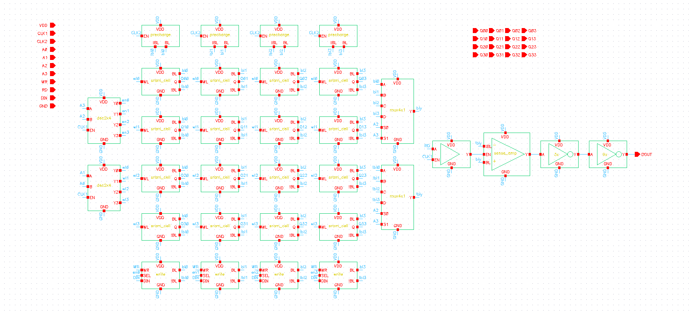
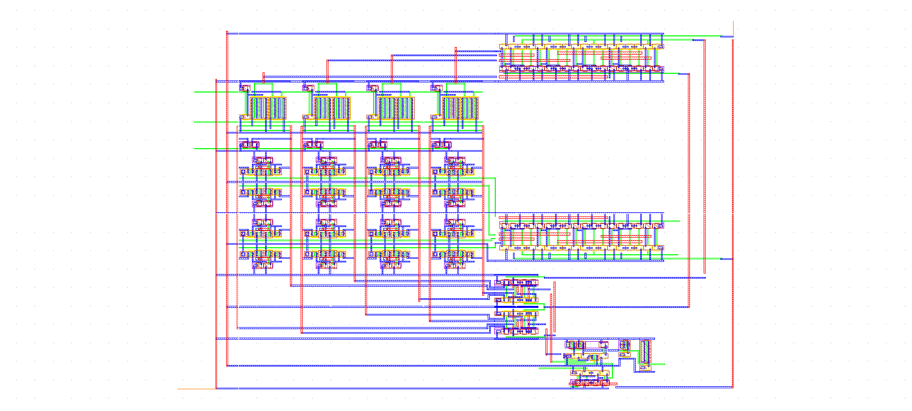

# 4x4 SRAM (45nm)

This project features a complete 4x4 (16-cell) Static Random-Access Memory (SRAM) designed using a 45nm process technology. Developed utilizing a bottoms-up, hierarchical philosophy, the design encompasses schematics, symbols, simulations, and physical layouts for 11 unique components.

## Architecture Overview

The top-level SRAM architecture coordinates several sub-circuits to successfully read, write, and store data within the 16-bit array. 

-   **Memory Array:** Features 16 individual SRAM cells, each utilizing a 6-transistor architecture (2 PMOS pull-up, 2 NMOS pull-down, 2 NMOS pass transistors) configured to avoid destructive reads.
-   **Precharge Circuits:** Four dedicated circuits precharge all bitlines (BL) and inverse bitlines (!BL) to VDD before every read or write operation.
-   **Address Decoding:** Two 2x4 decoders (constructed from 3-input NAND gates and inverters) route the 4-bit address input to select specific rows and columns.
-   **Write Circuitry:** Four write circuits pull the respective BL or !BL to ground based on the data input (DIN) and write enable signals. 
-   **Read Circuitry:** Two 4x1 multiplexers select the targeted BL and !BL pairs. A sense amplifier reads the voltage differential to determine the stored bit, and an output buffer cascade (3x and 9x inverters) amplifies and stabilizes the final data output (DOUT).

## Physical Layout

The full design was implemented in a custom physical layout, successfully passing Design Rule Checks (DRC) and Layout Versus Schematic (LVS) verification.

## Performance Summary

-   **Reliability:** The system achieved 100% correct Read after Write simulations across multiple input tests (all ones, all zeros, and alternating bit patterns).
-   **Precharge Timing:** The required precharge time between read/write cycles is 20.2 nanoseconds.
-   **Write Timing:** Writing a '1' completes in 115.88 picoseconds, while writing a '0' completes in 120.34 picoseconds.
-   **Read Timing:** Reading a '1' to the output completes in 119.54 picoseconds, while reading a '0' completes in 651.76 picoseconds.